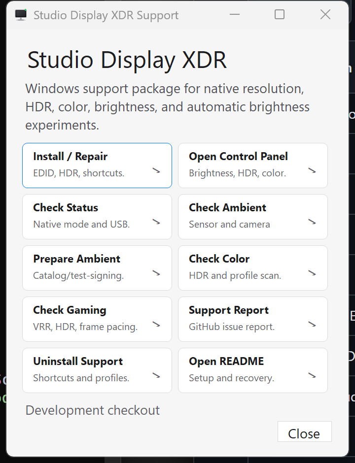
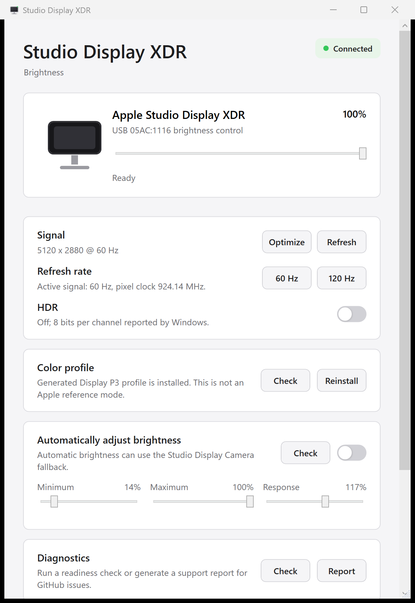
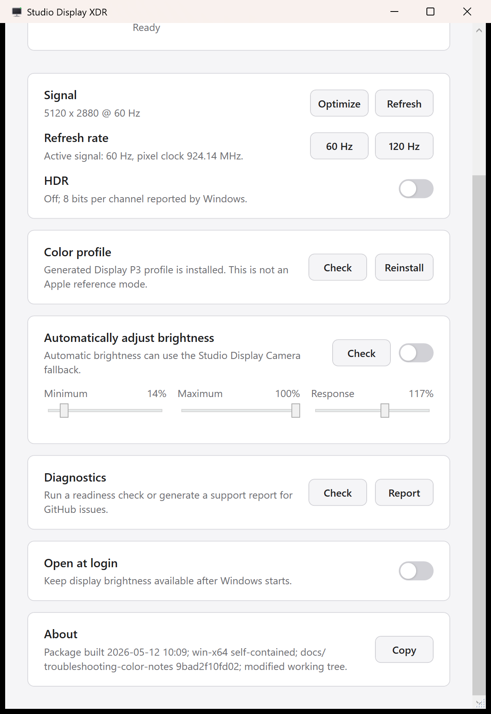

# Apple Studio Display XDR on Windows

This repo documents and packages a Windows workaround for the 2026 Apple Studio Display XDR when Windows only exposes fallback modes such as `1920 x 1080`.

Validated locally:

- `5120 x 2880`
- `120 Hz`
- HDR / Advanced Color enabled through the Windows DisplayConfig API
- 10 bits per color channel after HDR enable
- Studio Display XDR USB devices detected: camera, speakers, microphone, HID brightness interface
- Brightness control over Apple USB HID, no DDC/CI required
- Native Windows control panel for Studio Display XDR brightness
- Experimental automatic brightness connector targeting the display's hidden `MI_08` light-sensor interface

## Why This Is Needed

On some Windows PCs, the Studio Display XDR connects successfully over Thunderbolt/USB4, but Windows reads a fallback monitor EDID:

```text
DISPLAY\MS_0001
640 x 480
1920 x 1080 @ 60 Hz
```

The display itself is capable of 5K/120/HDR. Linux reports confirm the display exposes the panel as a tiled MST display, `2x 2560x2880`, and compositors such as Hyprland merge it into one `5120x2880` display.

This project installs a complete Studio Display XDR EDID override so Windows can expose the native mode.

## Tested Setup

Primary tested Windows setup:

- Alienware Area-51 desktop
- NVIDIA GeForce RTX 5090
- Intel Thunderbolt/USB4 display path
- Apple Studio Display XDR, USB product ID `05AC:1116`
- Windows 11

Known-good Linux report:

- HP ZBook Ultra G1a
- AMD Ryzen AI MAX+ PRO 395 / Radeon 8060S
- NixOS, kernel 6.19.9
- Hyprland
- `5120x2880 @ 120 Hz`, HDR metadata, and sleep/wake working

## Downloads

Each GitHub release ships two ZIP files. Both contain the same PowerShell scripts, `.cmd` launchers, EDID override, generated Display P3 profile, and docs.

| Package | File | Use it when |
| --- | --- | --- |
| Full (GUI) | `studio-display-xdr-windows.zip` | You want `StudioDisplayXdrSetup.exe` and the self-contained Studio Display XDR control panel: brightness slider, one-click `5K @ 120 Hz` + HDR, automatic brightness, diagnostics. About 75 MB. No separate .NET install is needed. |
| Scripts only (no GUI) | `studio-display-xdr-windows-scripts.zip` | You only want the EDID override, HDR toggle, brightness scripts, and diagnostics from `.cmd` launchers or PowerShell. Under 1 MB. `Studio-Display-XDR.cmd` opens a lightweight PowerShell brightness tray instead of the control panel. |

Releases: https://github.com/bindeman/2026-apple-studio-display-xdr-windows-override/releases

Every script runs under the built-in Windows PowerShell 5.1 (`powershell.exe`). PowerShell 7 is not required.

## Quick Start

Disconnect other Apple external displays for the first install if possible. This avoids accidentally applying the override to the wrong monitor.

Run the setup launcher from the extracted package:

```text
StudioDisplayXdrSetup.exe
```

Choose `Install or Repair Support`.



The command-line guided installer is also available:

```text
Install-StudioDisplayXdrSupport.cmd
```

It checks the Studio Display XDR monitor identity, installs the EDID override, offers to enable HDR, tests whether Windows accepts `5120 x 2880 @ 120 Hz`, verifies the brightness HID path, and opens the control panel.

During install, the guided installer offers to copy the packaged app files into a stable per-user folder:

```text
%LOCALAPPDATA%\StudioDisplayXdr\Support
```

Start Menu and Desktop shortcuts point at that stable folder, so they keep working after you move or delete the extracted ZIP folder.

The setup launcher also includes `Check Status`, a concise read-only readiness check for display mode, HDR, brightness HID, camera/audio, color profile, and ambient-sensor state. `Check Ambient` runs a focused automatic-brightness preflight for Windows ALS, native `MI_08`, libusb, and camera fallback. `Check Color` reports HDR/color target state and local profile candidates.

Manual install is also available from an elevated PowerShell:

```powershell
powershell -ExecutionPolicy Bypass -File .\scripts\Install-StudioXdrEdidOverride.ps1
```

The installer backs up the current monitor EDIDs under `backups\`, writes the override to the monitor's `EDID_OVERRIDE` registry key, and prints the key it changed. Nothing changes on screen until you reboot.

> Packages before `v0.1.0` ended the installer with `Select-Object : Property "PSObject" cannot be found` under Windows PowerShell 5.1 ([issue #3](https://github.com/bindeman/2026-apple-studio-display-xdr-windows-override/issues/3)). The override had already been written at that point, so a reboot still enabled 5K. `v0.1.0` fixes the error.

Reboot Windows.

Then open:

```text
Settings > System > Display
```

Set:

```text
Display resolution: 5120 x 2880
Refresh rate:       120 Hz
```

If Windows Settings does not show HDR, run:

```powershell
powershell -ExecutionPolicy Bypass -File .\scripts\Enable-StudioXdrHdr.ps1
```

Expected output after HDR is enabled:

```text
Display=Studio XDR
SetError=0
Supported=True
Enabled=True
BitsPerChannel=10
```

To turn HDR / Advanced Color back off:

```powershell
powershell -ExecutionPolicy Bypass -File .\scripts\Disable-StudioXdrHdr.ps1
```

## Simple Launchers

These launchers are included for convenience:

```text
StudioDisplayXdrSetup.exe
Install-StudioXdr.cmd
Install-StudioDisplayXdrSupport.cmd
Uninstall-StudioDisplayXdrSupport.cmd
Prepare-Ambient-Driver.cmd
Install-Ambient-Connector.cmd
Install-LibUsb-Ambient-Filter.cmd
Uninstall-LibUsb-Ambient-Filter.cmd
Install-Color-Profile.cmd
Enable-HDR.cmd
Disable-HDR.cmd
Studio-Display-XDR.cmd
Support-Report.cmd
Check-Status.cmd
Check-Ambient.cmd
Check-Gaming.cmd
Check-Color.cmd
Apple-Brightness-Tray.cmd
Brightness-Up.cmd
Brightness-Down.cmd
Brightness-Status.cmd
Uninstall-Override.cmd
```

`Install-StudioXdr.cmd` still needs to be run as administrator because Windows monitor EDID overrides live under `HKLM\SYSTEM`.

`Studio-Display-XDR.cmd` opens the Studio Display XDR control panel. In an extracted release package, the compiled app lives in:

```text
StudioDisplayXdr.App\StudioDisplayXdr.exe
```

In a development checkout, the latest local build is also staged under `dist\StudioDisplayXdr.App\StudioDisplayXdr.exe`.

The app is Studio Display XDR only. It does not expose Pro Display XDR controls.

After the guided installer stages a stable app copy, release-package launchers prefer `%LOCALAPPDATA%\StudioDisplayXdr\Support\StudioDisplayXdr.App\StudioDisplayXdr.exe`. Development checkouts keep opening the local build under the repo.

The packaged app is a self-contained `win-x64` build, so the release ZIP should not require a separate .NET runtime install.

When installed through the setup launcher, the same self-contained app is staged under `%LOCALAPPDATA%\StudioDisplayXdr\Support\StudioDisplayXdr.App`.

The control panel includes:

- Connection state for the Studio Display XDR HID control path
- One brightness slider per detected Studio Display XDR
- Current signal status, including resolution, refresh rate, HDR state, and bits per color channel
- One-click display optimization for `5120 x 2880 @ 120 Hz` plus HDR / Advanced Color
- Manual 60 Hz / 120 Hz switching
- Manual HDR / Advanced Color toggle
- Generated Display P3 color-profile install control
- In-app color/profile check for Apple, Pro Display, P3, Adobe, and HDR ICC/ICM candidates
- Automatic brightness status and toggle with best-available ambient source selection
- In-app ambient-source check that reports whether native `MI_08`, Windows ALS, or camera fallback is currently usable
- Auto-brightness minimum, maximum, and response controls for camera fallback calibration
- In-app readiness check for native mode, HDR, brightness HID, camera/audio, color profile, and ambient sensor state
- Diagnostics report generation for GitHub issues
- An Open at login preference that starts the app in the Windows notification area
- Single-instance behavior: launching the app again opens the existing control panel instead of creating duplicate tray icons
- About/build metadata from `PACKAGE.json` with one-click copy for support issues





Automatic brightness source priority:

1. Windows native ambient-light sensor, if Windows exposes one. The app and console checks enumerate available Windows light sensors and prefer Apple/display-looking sensors first, so a connected Pro Display XDR or older Studio Display can act as the ambient source if Windows exposes it.
2. Experimental Studio Display XDR `MI_08` sensor connector, if bound and readable.
3. Opt-in Studio Display Camera fallback, when no sensor path is available.

The camera fallback is experimental. It samples frame brightness from the working Studio Display Camera and maps that to the same Apple HID brightness path. It is useful as a practical workaround, but it is not the same as a true calibrated ambient-light sensor.

If automatic brightness is enabled, the app remembers that opt-in and resumes it on launch when an ambient source is available. With Open at login enabled, that means auto-brightness can resume after Windows starts while the app runs quietly in the notification area.

Safety behavior for camera fallback:

- Near-black frames pause automatic brightness instead of dimming the display.
- Camera readings use a higher brightness floor than true ambient-light sensors.
- Turning automatic brightness off releases the camera.

Build the local package with:

```powershell
powershell -ExecutionPolicy Bypass -File .\scripts\Build-StudioDisplayXdrPackage.ps1
```

Run the full local release gate:

```powershell
powershell -ExecutionPolicy Bypass -File .\scripts\Test-StudioDisplayXdrRelease.ps1
```

Smoke-test the extracted release layout:

```powershell
powershell -ExecutionPolicy Bypass -File .\scripts\Test-StudioDisplayXdrExtractedPackage.ps1
```

Smoke-test the local app startup/tray behavior:

```powershell
powershell -ExecutionPolicy Bypass -File .\scripts\Test-StudioDisplayXdrAppRuntime.ps1
```

Smoke-test the local app buttons for color, ambient, and readiness checks:

```powershell
powershell -ExecutionPolicy Bypass -File .\scripts\Test-StudioDisplayXdrAppUi.ps1
```

Run `Test-StudioDisplayXdrAppRuntime.ps1` and `Test-StudioDisplayXdrAppUi.ps1` sequentially, or use `Test-StudioDisplayXdrRelease.ps1`, because both app tests intentionally stop/start `StudioDisplayXdr`.

Release checklist: [docs/release-checklist.md](docs/release-checklist.md).
First-party parity audit: [docs/parity-audit.md](docs/parity-audit.md).

Generate a support report for GitHub issues or before/after driver tests:

```text
Support-Report.cmd
```

Run a concise local readiness check:

```text
Check-Status.cmd
```

It prints pass/warn/info rows plus a short next-steps summary.

Run a focused automatic-brightness preflight:

```text
Check-Ambient.cmd
```

It summarizes whether Windows ALS, the native `MI_08` path, a libusb filter, or camera fallback is currently available.

Run a color/profile check:

```text
Check-Color.cmd
```

It reports the active HDR/color target and scans for valid `.icc` / `.icm` files in the bundled profile folder, Windows color store, and likely Apple/user folders. This is useful for confirming whether any Apple or Pro Display XDR profile is actually present before trying to reuse it.

Run a gaming/tearing diagnostic:

```text
Check-Gaming.cmd
```

It reports the active Studio Display XDR signal, HDR / Advanced Color state, 5K120 mode-test result, GPU drivers, `nvidia-smi` output when available, Windows graphics registry hints, and a first-pass frame-cap recommendation for V-Sync/VRR testing.

Reports are written under `reports/` and include display mode, HDR/color state, gaming/tearing diagnostics, brightness HID, ambient connector status, app settings, Open at login state, stable install state, Studio Display USB devices, camera/audio devices, graphics drivers, and package artifacts.
Release packages include a generated `PACKAGE.json`, and support reports include that metadata even when the user is running from a downloaded ZIP instead of a git checkout.

The Studio Display XDR control panel also has a Diagnostics section that runs the readiness check and generates the same support report from the app.

When filing a GitHub issue, attach the generated support report. The repository issue templates separate normal display/install/brightness bugs from the experimental ambient-sensor driver work.

For deeper sensor research, dump the Apple display USB composite topology:

```powershell
powershell -ExecutionPolicy Bypass -File .\scripts\Get-AppleDisplayUsbTopology.ps1
```

This is read-only and is useful when comparing Studio Display XDR, older Studio Display, and Pro Display XDR interface layout.

To correlate Apple display USB containers with Windows Sensor-class and WinRT `LightSensor` candidates:

```powershell
powershell -ExecutionPolicy Bypass -File .\scripts\Get-AppleDisplaySensorCorrelation.ps1
```

Current Studio Display XDR finding: `MI_08` is present as `HID Relay`, bound to Microsoft `input.inf` / `HidUsb`, and fails with Code 10 because Windows rejects the HID report descriptor.
The currently mapped HID collections are documented in [docs/hid-research.md](docs/hid-research.md); notably, `MI_09` is an orientation sensor path, not an ambient-light path.

To remove the support package configuration, run:

```text
Uninstall-StudioDisplayXdrSupport.cmd
```

The guided uninstaller removes the app startup entry, shortcuts, and the stable `%LOCALAPPDATA%\StudioDisplayXdr\Support` app copy by default, and can optionally remove the generated color-profile association or the EDID override.
It can also remove the experimental libusb-win32 `MI_08` filter if that native-sensor experiment was installed.

## Verify

Run:

```powershell
powershell -ExecutionPolicy Bypass -File .\scripts\Get-StudioXdrStatus.ps1
```

Known-good active mode:

```text
Intel(R) Graphics
5120 x 2880
120 Hz
```

The HDR script verifies the Advanced Color state through the Windows DisplayConfig API.

## What The Installer Does

The installer:

1. Finds the active monitor node, usually `DISPLAY\MS_0001`.
2. Backs up current monitor EDIDs into `backups/`.
3. Writes `EDID_OVERRIDE` blocks from `edid/studio-display-xdr-ae42.bin`.
4. Offers Windows HDR / Advanced Color enablement.
5. Tests whether Windows accepts `5120 x 2880 @ 120 Hz` and can apply it when explicitly confirmed.
6. Offers the experimental native-sensor paths for automatic brightness, both defaulting to no:
   - WinUSB binding for `USB\VID_05AC&PID_1116&MI_08`.
   - SDBC-style libusb-win32 filter for `vid:05ac pid:1116 rev:1801 mi:08`.
7. Leaves the original monitor EDID untouched.

The EDID identifies as:

```text
Manufacturer: Apple
Product:      AE42
Name:         Studio XDR
```

No Boot Camp driver is required for the native display mode.

## HDR Notes

After the EDID override, Windows may know HDR is supported but still hide or fail to expose the Settings toggle.

Locally, the Windows DisplayConfig API reported:

```text
Before: AdvancedColorRaw=5, Enabled=False, BitsPerChannel=8
After:  AdvancedColorRaw=7, Enabled=True,  BitsPerChannel=10
```

That is what `scripts\Enable-StudioXdrHdr.ps1` does.

This is Windows HDR / Advanced Color support. It should not be described as full Apple-native reference-mode support. Apple's macOS presets combine firmware behavior, luminance targets, EOTF, gamut mapping, and color-management metadata that this repo does not fully recreate yet.

## Color Profile Notes

The EDID override includes the display's wide-color and HDR metadata. Windows can then expose the display as a wide-color/HDR target and output a 10-bpc signal path when Advanced Color is enabled.

This does not install Apple's macOS reference presets. Apple reference modes such as `Apple XDR Display (P3-2000 nits)` and `Apple XDR Display (P3 + Adobe RGB-2000 nits)` are part of Apple's display preset system on macOS. On Windows, this repo currently provides the display mode and HDR transport path, not Apple's full preset UI.

Practical current state:

- The display hardware supports P3 and Adobe RGB wide gamut.
- The imported EDID advertises BT.2020 / HDR static metadata.
- Windows HDR / Advanced Color can be enabled and reports 10 bits per channel.
- Color-managed apps can use Windows color management.
- This repo includes a generated Display P3 D65 gamma 2.2 ICC profile for a baseline Windows association.
- This repo does not include an Apple-authored Studio Display XDR ICC/ICM reference-mode profile.
- Apple's Studio Display XDR technology overview says non-macOS hosts use VESA DisplayID / EDID and are color-space-limited to P3 even when BT.2020 capability is reported, so this repo should not claim full Apple reference-mode parity on Windows.

Install the generated profile:

```text
Install-Color-Profile.cmd
```

You can also install it from the Studio Display XDR control panel's Color profile row.

For color-critical work, use a hardware calibrator and create a Windows ICC profile for your specific display. A calibrator-generated profile should be preferred over the bundled generated baseline.

The bundled EDID already advertises about `2030 nits` peak HDR luminance. It does not appear to be using a Pro Display XDR `1600 nits` value. The max frame-average luminance field is about `604 nits`, but that is not the same thing as Apple's SDR reference-mode brightness.

Related Apple documentation:

- [Studio Display XDR tech specs](https://support.apple.com/en-us/126323) list Apple XDR Display reference modes and wide-color support.
- [Apple display preset documentation](https://support.apple.com/en-ca/108321) describes XDR presets including P3 and P3 + Adobe RGB modes.
- [Studio Display XDR technology overview](https://www.apple.com.cn/studio-display-xdr/pdf/Studio_Display_XDR_Technology_Overview_White_Paper_ROW.pdf) documents 5K/120, Adaptive Sync, 2000-nit HDR peak behavior, front/rear ambient sensors, and the non-macOS EDID/DisplayID color limitation.

More detail: [docs/color-management.md](docs/color-management.md).
Current feature status: [docs/support-matrix.md](docs/support-matrix.md).

Color status:

```powershell
powershell -ExecutionPolicy Bypass -File .\scripts\Get-StudioXdrColorStatus.ps1
```

Install and associate an ICC/ICM profile when one is available:

```powershell
powershell -ExecutionPolicy Bypass -File .\scripts\Install-StudioXdrColorProfile.ps1 -ProfilePath .\profiles\StudioXDR.icm
```

## Camera, Speakers, and Microphone

These enumerate as standard Windows devices on the tested machine:

```text
Studio Display Camera
Speakers (Studio Display Audio)
Microphone (Studio Display Audio)
```

No custom driver was required for those devices. The custom work in this repo focuses on display mode negotiation, HDR toggle control, brightness HID control, and experimental ambient-light sensor access.

## Pixelated Tile / Link Artifacts

If part of the screen appears pixelated after switching to 5K/120, especially a fixed section on the right side, it is likely a transient tile/link/DSC state.

Known local fix:

1. Change refresh rate from `120 Hz` to `60 Hz`.
2. Apply.
3. Change back to `120 Hz`, `120.04 Hz`, or Dynamic Refresh Rate.

This forces Windows, the GPU driver, and the Thunderbolt/DisplayPort link to retrain the display timing. If `120.04 Hz` is stable on your system, it is fine to use; it is just a slightly different timing entry, not inherently better than exact `120 Hz`.

## DisplayPort Adapter Notes

The known-good path is Thunderbolt/USB4 from the PC to the Studio Display XDR.

A DisplayPort-to-USB-C/Thunderbolt adapter that produces a black screen is usually not fixable with an EDID override because Windows never sees a monitor to override. Direction also matters: most `USB-C to DisplayPort` cables are the wrong direction for Apple displays.

More detail: [docs/displayport-adapters.md](docs/displayport-adapters.md).

## Automatic Brightness

Automatic brightness is experimental.

Windows does not currently expose the Studio Display XDR as a normal ambient-light sensor. The likely sensor path is:

```text
USB\VID_05AC&PID_1116&MI_08
```

On the tested machine, that interface is present but bound to Microsoft's generic HID driver and fails with Code 10 because the HID report descriptor does not validate. Older Studio Display tools used the same `MI_08` interface number to read ambient-light packets, so this repo includes an experimental WinUSB connector and packet probe.

Apple documents front and rear ambient light sensors for Studio Display XDR. The open problem is not whether the hardware exists; it is getting Windows to read an Apple-private sensor interface that currently fails the inbox HID path.

The packet probe detects the repo's custom WinUSB device-interface GUID and also a generic USB device-interface path from a manual Zadig/libwdi binding, as long as the exact `MI_08` interface is the device that was bound.

The bundled WinUSB INF follows Microsoft's documented WinUSB include/needs pattern and declares `CatalogFile = StudioXdrAmbientWinUsb.cat`, but it is still an unsigned experimental package in the public ZIP. A normal Windows install may require a signed/test-signed catalog or a libwdi/Zadig-generated WinUSB package for the exact `MI_08` interface before Windows will rank it against `input.inf`.

If the Windows Driver Kit is installed, the package includes a guarded helper that checks for `inf2cat.exe` and `signtool.exe`, generates the catalog, and can test-sign it with a local code-signing certificate:

```text
Prepare-Ambient-Driver.cmd
```

This helper does not bind the driver. After the catalog is generated and trusted locally, use `Install-Ambient-Connector.cmd` to try the actual `MI_08` WinUSB binding.

The packaged app also includes an optional SDBC-style libusb reader for the same `MI_08` interface. If `vid:05ac pid:1116 rev:1801 mi:08` is exposed through a libusb-win32-compatible filter, automatic brightness can try that path before falling back to the Studio Display Camera.

Check status:

```powershell
powershell -ExecutionPolicy Bypass -File .\scripts\Get-StudioXdrAmbientStatus.ps1
```

Check whether the packaged WinUSB driver target matches the currently connected `MI_08` interface without changing drivers:

```powershell
powershell -ExecutionPolicy Bypass -File .\scripts\Test-StudioXdrAmbientDriverTarget.ps1
```

Quick preflight:

```powershell
powershell -ExecutionPolicy Bypass -File .\scripts\Test-StudioXdrAmbientPreflight.ps1
```

Probe the SDBC-style libusb path directly:

```powershell
powershell -ExecutionPolicy Bypass -File .\scripts\Test-StudioXdrLibUsbAmbient.ps1
```

Experimental installer:

```text
Install-Ambient-Connector.cmd
```

The packaged WinUSB INF targets the exact currently observed interface first:

```text
USB\VID_05AC&PID_1116&REV_1801&MI_08
USB\VID_05AC&PID_1116&MI_08
```

If Windows rejects the unsigned package or keeps `MI_08` on `HidUsb/input.inf`, the native connector is not active.

Experimental SDBC-style libusb filter launcher:

```text
Install-LibUsb-Ambient-Filter.cmd
```

The app enables the automatic brightness toggle when any supported source is available. Today that can be a Windows ambient-light sensor, the experimental `MI_08` WinUSB/libusb connector, or the opt-in Studio Display Camera fallback.

More detail: [docs/auto-brightness.md](docs/auto-brightness.md).
HID interface notes: [docs/hid-research.md](docs/hid-research.md).

## Brightness

Brightness is separate from the display mode issue, but it is working locally.

Apple displays do not use normal DDC/CI brightness. Studio Display XDR exposes brightness through Apple USB HID:

```text
VID_05AC&PID_1116
Usage Page: 0x0082
Usage:      0x0010
```

Read current brightness:

```powershell
powershell -ExecutionPolicy Bypass -File .\scripts\StudioXdrBrightness.ps1 -ListOnly
```

Set an approximate percent:

```powershell
powershell -ExecutionPolicy Bypass -File .\scripts\StudioXdrBrightness.ps1 -SetPercent 60
```

Step brightness up/down:

```powershell
powershell -ExecutionPolicy Bypass -File .\scripts\StudioXdrBrightness.ps1 -StepPercent 5
powershell -ExecutionPolicy Bypass -File .\scripts\StudioXdrBrightness.ps1 -StepPercent -5
```

Convenience launchers:

```text
Brightness-Up.cmd
Brightness-Down.cmd
Brightness-Status.cmd
```

Local validation:

```text
Current=60000 (~60%)
Set to 55000
Read back 55000 (~55%)
Set back to 60000
Read back 60000 (~60%)
```

More detail: [docs/brightness.md](docs/brightness.md).

### Brightness App

Run:

```text
Studio-Display-XDR.cmd
```

The app supports:

- Studio Display XDR (`PID_1116`)
- One slider per detected Studio Display XDR brightness HID endpoint
- Optional Open at login with notification-area background startup
- Experimental automatic brightness when the ambient connector works

`Apple-Brightness-Tray.cmd` is retained as a compatibility launcher and opens the compiled Studio Display XDR app when available.

## Gaming / Tearing

If tearing appears in games even with V-Sync enabled, test fixed `120 Hz` or `120.04 Hz`, cap frame rate slightly below refresh, and check VRR/G-SYNC/HDR interactions.

Capture the current Windows graphics path:

```text
Check-Gaming.cmd
```

Test whether Windows accepts 5K120 without changing the active mode:

```powershell
powershell -ExecutionPolicy Bypass -File .\scripts\Set-StudioXdrDisplayMode.ps1 -RefreshRate 120 -TestOnly
```

More detail: [docs/gaming-tearing.md](docs/gaming-tearing.md).

## Screenshots

Add screenshots under `docs/screenshots/`.

Recommended screenshot list:

- Before: Windows only exposes `1920 x 1080`
- Installer output
- Resolution list showing `5120 x 2880`
- Advanced display showing `120 Hz`
- HDR/Advanced Color enabled output
- Device Manager or PowerShell showing Studio Display XDR USB4/USB devices

See [docs/screenshots.md](docs/screenshots.md).

## Recovery

To remove the override, open an elevated PowerShell and run:

```powershell
powershell -ExecutionPolicy Bypass -File .\scripts\Uninstall-StudioXdrEdidOverride.ps1
```

Then reboot.

If the Studio Display XDR is black after the override (reported on a Mac Pro 2019 Boot Camp / Radeon Pro W6900X setup), boot into Safe Mode or use another monitor and run the same script with `-All`, which removes every override this project created even when the display is not active. WinRE offline registry steps are in [docs/recovery.md](docs/recovery.md).

More recovery notes are in [docs/recovery.md](docs/recovery.md).

## CRU Fallback

This repo no longer requires Custom Resolution Utility for the primary path.

CRU remains useful for inspection and manual fallback:

1. Select the active `Generic` / `MS_0001` display.
2. Import `edid/studio-display-xdr-ae42.bin`.
3. Choose `Import complete EDID`.
4. Restart the graphics driver or reboot.

## Packaging

`scripts\Build-StudioDisplayXdrPackage.ps1` builds two ZIPs and verifies both:

```text
dist\studio-display-xdr-windows.zip          full package: control panel GUI + StudioDisplayXdrSetup.exe + everything below
dist\studio-display-xdr-windows-scripts.zip  scripts-only package: everything below except StudioDisplayXdr.App/, StudioDisplayXdrSetup.exe, assets/, tools/
```

The package version comes from the repo-root `VERSION` file and is written into each ZIP's `PACKAGE.json` (`version`, `flavor`). Pushing a `v*` tag that matches `VERSION` makes GitHub Actions run the release gate and attach both ZIPs to a GitHub Release.

```powershell
powershell -ExecutionPolicy Bypass -File .\scripts\Test-StudioDisplayXdrRelease.ps1
```

Common contents:

```text
README.md
LICENSE
PACKAGE.json
CONTINUE.md
RELEASE_NOTES.md
Install-StudioDisplayXdrSupport.cmd
Prepare-Ambient-Driver.cmd
Install-Ambient-Connector.cmd
Install-Color-Profile.cmd
Install-StudioXdr.cmd
Uninstall-StudioDisplayXdrSupport.cmd
Enable-HDR.cmd
Disable-HDR.cmd
Studio-Display-XDR.cmd
Support-Report.cmd
Check-Status.cmd
Check-Ambient.cmd
Check-Gaming.cmd
Check-Color.cmd
Apple-Brightness-Tray.cmd
Brightness-Up.cmd
Brightness-Down.cmd
Brightness-Status.cmd
Uninstall-Override.cmd
scripts/
drivers/
edid/
profiles/
docs/
```

Full package only:

```text
StudioDisplayXdrSetup.exe
StudioDisplayXdr.App/
assets/
tools/LibUsbDotNet.LibUsbDotNet.net45.dll
```

Future work:

- Wrap the full installer flow as a signed EXE.
- Sign the ambient connector driver package.
- Find or measure better Studio Display XDR ICC/ICM profiles.

## Disclaimer

This project modifies Windows monitor EDID override registry keys. It does not flash the display and does not modify GPU drivers, but a bad monitor override can temporarily produce an unusable display mode. Keep another display or Safe Mode recovery path available.

Apple is a trademark of Apple Inc. This project is unofficial and is not affiliated with or endorsed by Apple.
